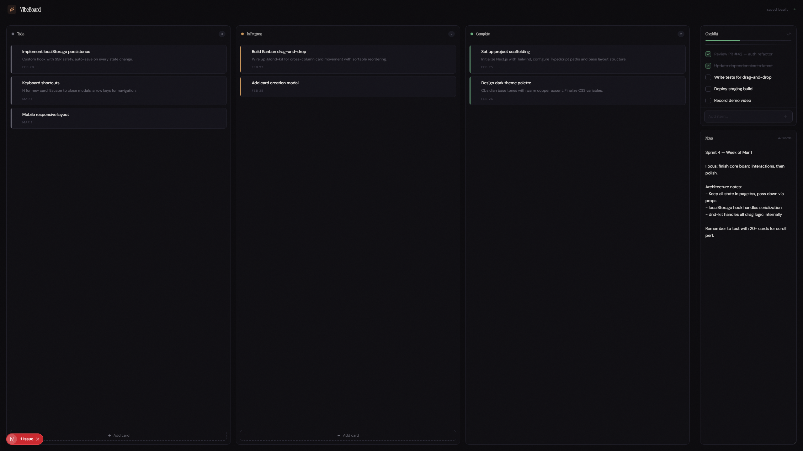

# VibeBoard

Project management for vibe coders — a dark-mode Kanban board with an integrated checklist and note-taking area.



## Features

- **Kanban Board** — Drag-and-drop cards across Todo, In Progress, and Complete columns
- **Checklist** — Quick add/check/delete with progress tracking
- **Notes** — Free-form text area with word count
- **Persistence** — All data saved to localStorage automatically
- **Dark Theme** — Obsidian Workshop aesthetic with warm copper accents

## Tech Stack

- Next.js (App Router)
- Tailwind CSS v4
- @dnd-kit (drag-and-drop)
- Lucide React (icons)
- TypeScript

## Getting Started

```bash
npm install
npm run dev
```

Open [http://localhost:3000](http://localhost:3000) in your browser.
